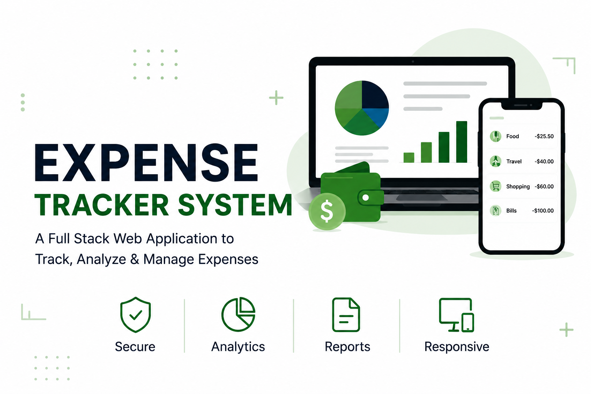
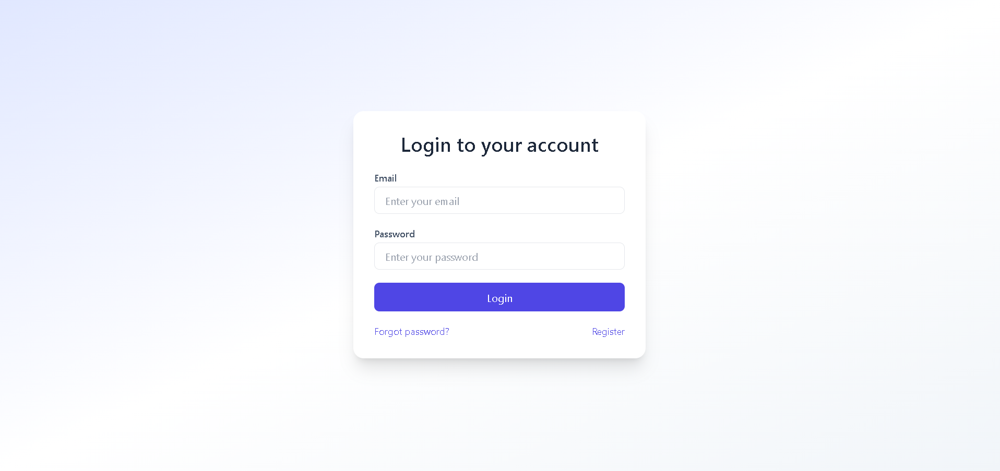
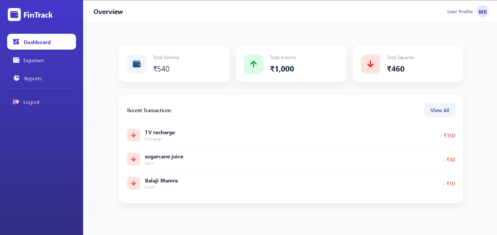
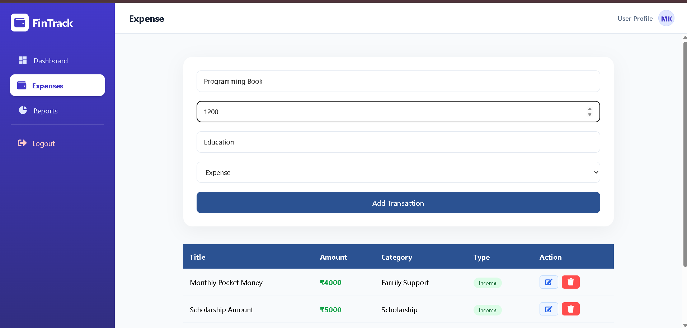
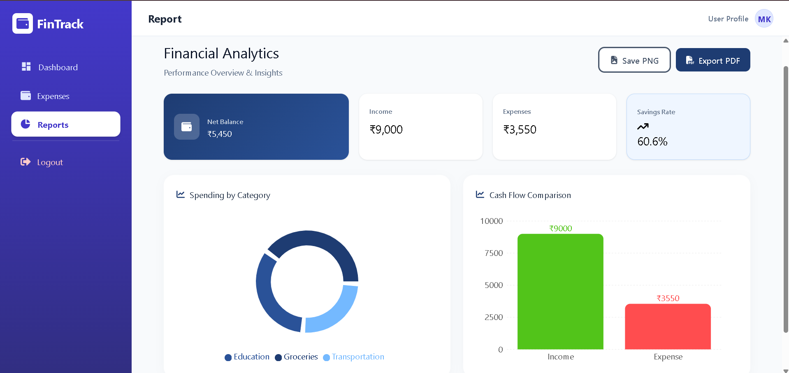

<p align="center">
  
</p>
# 💰 Expense Tracker System

A modern **Full Stack Expense Tracker Web Application** that helps users manage daily expenses, analyze spending, and generate reports.

---

## 🚀 Live Demo

🌐 https://expense-tracker-system-ten.vercel.app/login

---

## 🛠️ Tech Stack

### 🎨 Frontend
- React.js
- HTML5
- CSS3
- JavaScript
- Axios

### ⚙️ Backend
- Node.js
- Express.js

### 🗄️ Database
- MongoDB

### 🔐 Authentication
- JWT Authentication

---

## ✨ Features

- 🔐 Secure Login & Registration
- 💸 Add Daily Expenses
- ✏️ Edit Expenses
- 🗑️ Delete Expenses
- 📂 Expense Categories
- 📊 Dashboard Overview
- 📈 Expense Analytics
- 📅 Monthly Reports
- 👤 User-specific Expense Management
- 📱 Responsive Design
- 🔄 Complete CRUD Operations

---

## 📂 Project Structure

Frontend

Backend

Database

---

## 📸 Screenshots

### Login



### Dashboard



### Add Expense



### Analytics



### 

---

## 📥 Installation

Clone the repository

```bash
git clone https://github.com/Meet-Kanakiya/expense-tracker-frontend.git
```

Install dependencies

```bash
npm install
```

Start the project

```bash
npm run dev
```

---

## 📚 What I Learned

- Building Full Stack Applications
- REST API Development
- JWT Authentication
- MongoDB Integration
- CRUD Operations
- Responsive UI Design
- State Management
- Debugging Real-world Applications

---

## 👨‍💻 Developed By

**Meet Kanakiya**

GitHub:
https://github.com/Meet-Kanakiya

LinkedIn:
www.linkedin.com/in/meet-kanakiya-a5b951367
